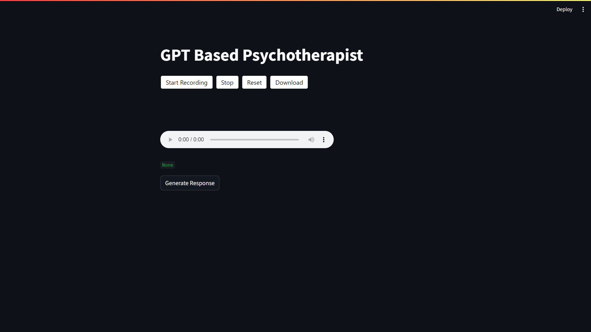
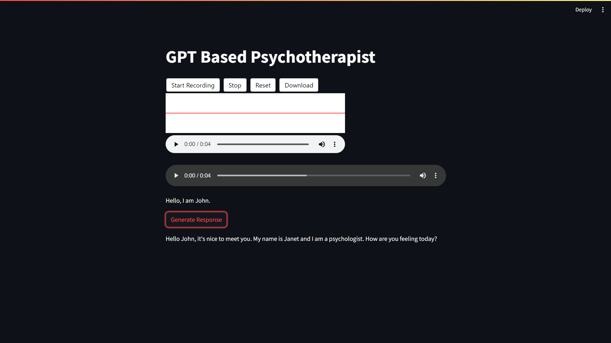

**Project Title:** GPT-Powered-Psychotherapist

**GitHub Repository:** [GPT-Powered-Psychotheripst](https://github.com/Aftabmallick/GPT-Powered-Psychotheripst.git)

## Description:
GPT-Powered-Psychotherapist is a project that leverages the power of OpenAI's GPT (Generative Pre-trained Transformer) model to simulate conversations with users, acting as a virtual psychotherapist. This project aims to provide a platform where users can engage in therapeutic conversations with an AI-powered entity. It accepts both voice and text inputs and provides responses in both voice and text formats, enhancing the user experience.

## Installation:
To run this project locally, ensure you have Python installed on your system. Then, follow these steps:

1. Clone the repository:
   ```
   git clone https://github.com/Aftabmallick/GPT-Powered-Psychotheripst.git
   ```

2. Navigate to the project directory:
   ```
   cd GPT-Powered-Psychotheripst
   ```

3. Install the required dependencies:
   ```
   pip install -r requirements.txt
   ```

## Usage:
Once the installation is complete, you can run the project using the following command:
```
streamlit run app.py
```

This will launch a Streamlit web application where users can interact with the GPT-powered psychotherapist. Users can input their queries using both voice and text. The application will process the input, generate responses, and provide both text and voice outputs.

## Screenshots



## Requirements:
- [langchain](https://pypi.org/project/langchain/)
- [openai](https://pypi.org/project/openai/)
- [huggingface_hub](https://pypi.org/project/huggingface-hub/)
- [python-dotenv](https://pypi.org/project/python-dotenv/)
- [streamlit](https://pypi.org/project/streamlit/)
- [pygame](https://pypi.org/project/pygame/)
- [langchain_openai](https://pypi.org/project/langchain-openai/)
- [streamlit-audiorec](https://pypi.org/project/streamlit-audiorec/)
- [openai-whisper](https://pypi.org/project/openai-whisper/)

## Contributors:
- [Aftabmallick](https://github.com/Aftabmallick)

## License:
This project is licensed under the [MIT License](https://github.com/Aftabmallick/GPT-Powered-Psychotheripst/blob/main/LICENSE).

---
Feel free to contribute to this project by forking and submitting pull requests. If you encounter any issues or have suggestions for improvement, please open an issue on the GitHub repository. Thank you for using GPT-Powered-Psychotherapist!
# Hi, I'm Aftab Mallick! 👋


## 🔗 Links
[](https://aftabmallick.github.io/MyWebsite/)
[](https://www.linkedin.com/in/aftab-mallick/)

